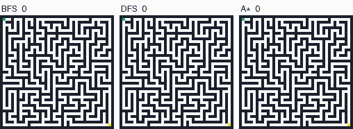
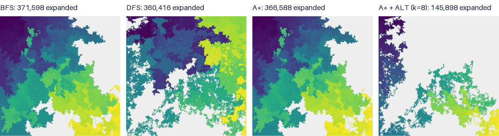

<div align="center">

# 🧭 Maze Search Lab

**When does a heuristic actually help?**<br>
An empirical study of breadth-first, depth-first and A* search on mazes with up to a million cells,
with a reproducible experiment pipeline and an interactive Streamlit app.


<!-- After pushing, add the live CI badge (replace YOUR-USERNAME):
[](https://github.com/YOUR-USERNAME/maze-search-lab/actions/workflows/ci.yml)
-->



<sub>Three searches on the same maze, one shared clock (cells expanded). Colour shows when a cell was expanded; red is the route.</sub>

</div>

---

## Why this project exists

A* is usually presented as the clever way to find a path: a heuristic estimate of the remaining
distance steers it toward the goal, so it should explore far less than a blind search. I wanted to
see how true that is on large mazes, and when it isn't, to find out *why* and what fixes it.

The answer turned out to be more interesting than "A* wins". On a winding million-cell maze, A*
saved barely 1% of the work of breadth-first search and took almost twice as long. Change the
maze, or give A* better information, and the picture flips completely. This repository contains
the code, the data and the evidence for each of those claims.

## Key findings

All numbers come from `data/results`, produced by `scripts/run_experiments.py` (seeded and
deterministic; only the timings depend on the machine).

| # | Finding | Evidence |
|---|---|---|
| 1 | **A* barely beats BFS on a winding maze.** | On the 1,001 × 1,001 study maze, A* expanded 366,588 cells against 371,598 for BFS (1.3% fewer) and took 0.99 s against 0.56 s. |
| 2 | **The heuristic can only prune a thin band, and this is provable.** | A* must expand every cell with *g\*(n) + h(n) < C\**. With *C\** = 76,360 and Manhattan distance never above 1,996, only 5,032 cells (1.0% of the maze) can ever be skipped. |
| 3 | **Loops break DFS and unlock A*.** | Opening 20% of the removable walls made DFS's route 11× longer than the shortest, while A* dropped to 31% of the cells against 100% for BFS, and became faster than BFS. |
| 4 | **Maze texture predicts the winner.** | Across 42 generated mazes, tortuosity (route length ÷ straight-line distance) ranks A*'s relative gain almost perfectly (Spearman ρ = 0.94). On near-straight Prim mazes, A* needs about 30% of BFS's work. |
| 5 | **A better heuristic fixes A*, at a price.** | With exact distances to 8 landmarks (ALT), A* needed a median 3.7× fewer expansions and ran 2.5× faster per query, with identical route lengths on all 30 test queries. The 4.3 s of preparation pays off after about 11 queries. |
| 6 | **Bidirectional BFS does not help on tree-like mazes.** | It expanded 7.7% *more* cells than BFS: when the number of reachable cells grows linearly with distance, two half-radius searches cost as much as one full one. |

The full write-up, with propositions, proofs, threats to validity and APA references, is in
[`docs/RESEARCH.md`](docs/RESEARCH.md).

<p align="center">
  <br>
  <sub>Where each algorithm searched on the study maze (dark = early, yellow = late, grey = never expanded).
  BFS and A* are nearly indistinguishable; landmark A* leaves most of the maze untouched.</sub>
</p>

## What's inside

1. **A dependency-free search library** (`mazesearch`): BFS, DFS and A*, plus uniform-cost search,
   weighted A*, greedy best-first search, bidirectional BFS and A* with landmark bounds. All eight
   share one interface and report the same work counters.
2. **Landmark (ALT) heuristic**: farthest-point landmark selection and flat `array('i')` distance
   tables (4 bytes per cell), following Goldberg and Harrelson (2005).
3. **Three seeded maze generators** with very different textures (recursive backtracker, Prim's
   algorithm, binary tree), plus transformations: add loops, remove walls, move the start or exit.
4. **An exit census**: the cost of reaching *every* possible exit, for BFS and DFS, from just two
   complete traversals (blind search order does not depend on the goal).
5. **Analysis tools**: maze structure statistics (dead ends, loops, tortuosity) and the exact set of
   cells A* must, may and need not expand for any heuristic.
6. **A reproducible experiment pipeline**: eight experiments, fixed seeds, resumable by stage
   (`--only E1 E2 …`), environment and run times recorded in `manifest.json`.
7. **A seven-page Streamlit app** that tells the story in order, with live solving, animated search
   races, a "DFS luck map", a heuristic-quality slider and a break-even chart.
8. **An image and GIF renderer** for search traces (the animation above is made with it).
9. **A command-line interface**: `python -m mazesearch generate | solve | stats`.
10. **Quality checks**: 22 tests, including an independent route validator and Streamlit's
    `AppTest` for every page, a GitHub Actions workflow, `CITATION.cff` and an MIT licence.
11. **Storage-conscious data**: all results take 338 kB, the million-cell study maze is gzipped
    to 91 kB (byte-reproducible), and the README images take about 110 kB.

## Quick start

```bash
git clone https://github.com/YOUR-USERNAME/maze-search-lab.git
cd maze-search-lab
python -m venv .venv && source .venv/bin/activate   # Windows: .venv\Scripts\activate
pip install -r requirements.txt
streamlit run app/Home.py
```

### Use the library

```python
from mazesearch import ALGORITHMS, generate_maze, braid

maze = braid(generate_maze(201, algorithm="prim", seed=7), fraction=0.05, seed=7)
for key in ("bfs", "dfs", "astar", "alt"):
    result = ALGORITHMS[key].search(maze)
    print(f"{result.algorithm:<16} path {result.path_length:>5}  expanded {result.nodes_expanded:>6}")
```

The solvers also accept a maze file, its text, a list of rows or a character grid, and give the
solution back in the same form with the route marked `*`:

```python
from mazesearch import maze_solver_three   # BFS, DFS and A* are maze_solver_one/two/three

print(maze_solver_three("data/mazes/study_1001x1001_backtracker_seed2026.txt.gz")[:200])
```

### Use the command line

```bash
python -m mazesearch generate --width 61 --generator prim --loops 0.1 --seed 3 -o maze.txt
python -m mazesearch solve maze.txt --algorithms all
python -m mazesearch stats maze.txt
```

### Maze format

Plain text: an optional first line `width height`, then one row per line. `S` is the start, `E` the
exit, `X` a wall, and anything else is open floor. Moves go up, down, left or right, each costing 1.
Files ending in `.gz` are read and written compressed.

## The app

| Page | What it shows |
|---|---|
| **Home** | The question, an animated race and the five findings, each linked to its evidence. |
| **1 · Maze Lab** | Generate or upload a maze, pick any algorithms and watch them race live; scrub through the search step by step and download the solutions. |
| **2 · Benchmark** | Time, work and memory for eight algorithms on the study maze, every timed run, a work funnel and exploration maps. |
| **3 · Why A* Struggles** | The pruning band, estimate versus truth along the route, a heuristic-quality slider and the distance field. |
| **4 · What-If Lab** | Loops, exit position (with a census of every exit), DFS move order, an open room, and maze texture and size. |
| **5 · Landmark Heuristics** | Landmark positions, the work saved per query and when preparation pays off. |
| **6 · Methods & Data** | Protocol, environment, a data dictionary and references. |

To deploy it, push the repository to GitHub and create an app on
[Streamlit Community Cloud](https://streamlit.io/cloud) with `app/Home.py` as the entry point;
`requirements.txt` and `.streamlit/config.toml` are picked up automatically.

## Reproduce the study

```bash
python scripts/run_experiments.py            # all eight experiments, about 6 minutes on one core
python scripts/run_experiments.py --quick    # smoke run on small mazes, a few seconds
python scripts/run_experiments.py --only E3  # one stage; other results are kept
python scripts/run_experiments.py --maze path/to/your_maze.txt   # study any maze file
python scripts/make_assets.py                # rebuild the README images
```

| Stage | Experiment | Output |
|---|---|---|
| E1 | Benchmark of eight algorithms (7 interleaved timed runs each, plus memory) | `benchmark.csv`, `benchmark_runs.csv` |
| E2 | Pruning band, heuristic ablation, quality curve, maps | `heuristics.csv`, `depth_hist.csv`, `route_profile.csv`, `quality_curve.csv` |
| E3 | Exit census for all 499,998 exits, checked against real searches | `exit_bins.csv`, `exits_sample.csv` |
| E4 | Adding loops (8 levels × 3 seeds) | `loops.csv` |
| E5 | DFS with all 24 move orders | `move_orders.csv` |
| E6 | The maze with every interior wall removed | `open_room.csv` |
| E7 | Three generators × seven sizes × two seeds | `scaling.csv`, `scaling_fits.csv` |
| E8 | Landmark heuristics on 30 random queries | `landmarks.csv`, `landmarks_build.csv` |

## Project structure

```text
maze-search-lab/
├── mazesearch/            # the library (standard library only, except render.py)
│   ├── core.py            # maze model, parsing, BFS, DFS, A*
│   ├── algorithms.py      # UCS, weighted A*, greedy, bidirectional BFS, landmark A*, registry
│   ├── heuristics.py      # Manhattan, Euclidean, weighted, landmark (ALT) heuristic
│   ├── generate.py        # backtracker, Prim, binary tree; loops, open rooms, moving S/E
│   ├── analysis.py        # structure stats, A* must-expand profile, exit census
│   ├── bench.py           # interleaved timing and tracemalloc memory
│   ├── render.py          # images and animated GIF races (NumPy + Pillow)
│   └── cli.py             # python -m mazesearch …
├── app/                   # Streamlit app: Home.py, common.py and six pages
├── scripts/               # run_experiments.py, make_assets.py
├── data/
│   ├── mazes/             # the gzipped 1,001 × 1,001 study maze
│   └── results/           # every dataset the app and the docs use (338 kB)
├── docs/                  # RESEARCH.md and the README images
├── tests/                 # pytest suite, including AppTest for every page
├── .github/workflows/     # CI: lint, doctest, tests, pipeline smoke run
└── pyproject.toml, requirements.txt, Makefile, CITATION.cff, LICENSE, CHANGELOG.md
```

## How it works, briefly

| Algorithm | Frontier | Optimal? | Note |
|---|---|---|---|
| BFS | FIFO queue | yes | Goal test when a cell is generated, which saves a whole ring. |
| DFS | LIFO stack | no | Explicit stack; cells marked when popped, matching recursive DFS. |
| A* | binary heap on *g + h* | yes | Manhattan heuristic; ties go to the smaller *h*; lazy deletion. |
| Bidirectional BFS | two queues | yes | Expands whole layers from both ends and finishes the meeting layer. |
| UCS / weighted A* / greedy | heap | yes / no / no | Same A* code with *h* = 0, *w·h*, or *h* alone. |
| A* + landmarks | heap | yes | max over landmarks of \|d(L, n) − d(L, t)\|, admissible and consistent. |

None of the searches is recursive: the route through the study maze is 76,360 moves deep, far past
Python's default recursion limit of 1,000. Every algorithm is a graph search, so none expands a
cell twice. The design decisions and the reasons behind them are discussed in
[`docs/RESEARCH.md`](docs/RESEARCH.md#5-design-decisions-and-why).

## Testing and quality

```bash
pip install pytest ruff
python -m pytest -q      # 22 tests; the app test runs when Streamlit and Plotly are installed
ruff check .
python -m doctest mazesearch/core.py
```

The tests check exact answers on hand-made mazes and every input form. They also check that every
algorithm returns a valid route on 24 random mazes with loops, and that the optimal ones always
match BFS. Further tests confirm the heuristics are admissible and consistent, that the exit census
equals real searches, and that A* stays inside the window predicted by theory. The CI workflow runs
all of this on Python 3.9, 3.11 and 3.12.

## Citation

If you use the code or the results, please cite the repository (GitHub reads `CITATION.cff`):

> Goel, A. (2026). *Maze Search Lab: Blind and heuristic search on large grid mazes* (Version 1.0.0) [Computer software].

## Key references

- Goldberg, A. V., & Harrelson, C. (2005). Computing the shortest path: A* search meets graph theory. In *Proceedings of the Sixteenth Annual ACM-SIAM Symposium on Discrete Algorithms* (pp. 156–165). Society for Industrial and Applied Mathematics.
- Hart, P. E., Nilsson, N. J., & Raphael, B. (1968). A formal basis for the heuristic determination of minimum cost paths. *IEEE Transactions on Systems Science and Cybernetics, 4*(2), 100–107. https://doi.org/10.1109/TSSC.1968.300136
- Russell, S., & Norvig, P. (2021). *Artificial intelligence: A modern approach* (4th ed.). Pearson.

The complete reference list is in [`docs/RESEARCH.md`](docs/RESEARCH.md#references).

## Licence and author

Released under the [MIT licence](LICENSE). Built by **Anush Goel**: questions, issues and pull
requests are welcome.
